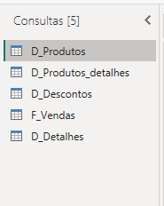
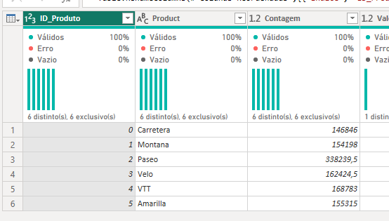
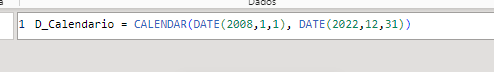
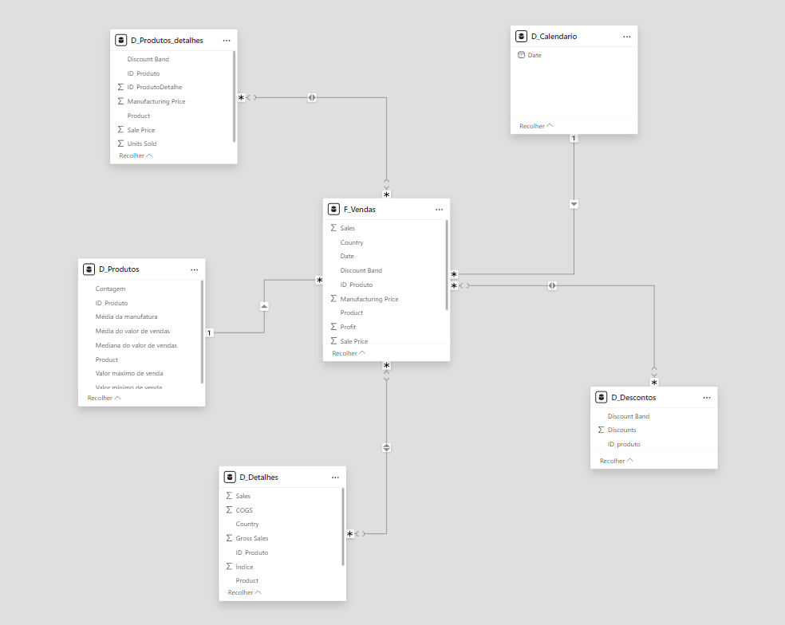

# Dashboard_Star_Dax_Formula_Training

Modelando um Dashboard de E-commerce com Power BI Utilizando Fórmulas DAX

## Etapas:

Para realização desse projeto foi necessário começar a transformar dados do dataset Financials.
Como esse modelo é feito baseado no star-schema, primeiramente foram criadas várias tabelas a partir da tabela original, sendo elas as tabelas de Dimensões e a Tabela Fato.
A tabela fato desse esquema foi a tabela Vendas:

Após isso foi necessário executar diversas ações para adequar as tabelas, sendo elas adicionar coluna de indices e coluna condicional:

Também foi necessário cirar uma tabela de Datas/calendario com o comando DAX

E por fim criar o relacionamento das tabelas!

